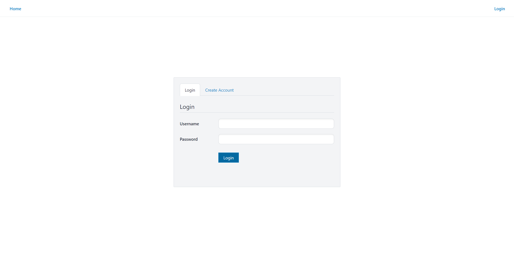
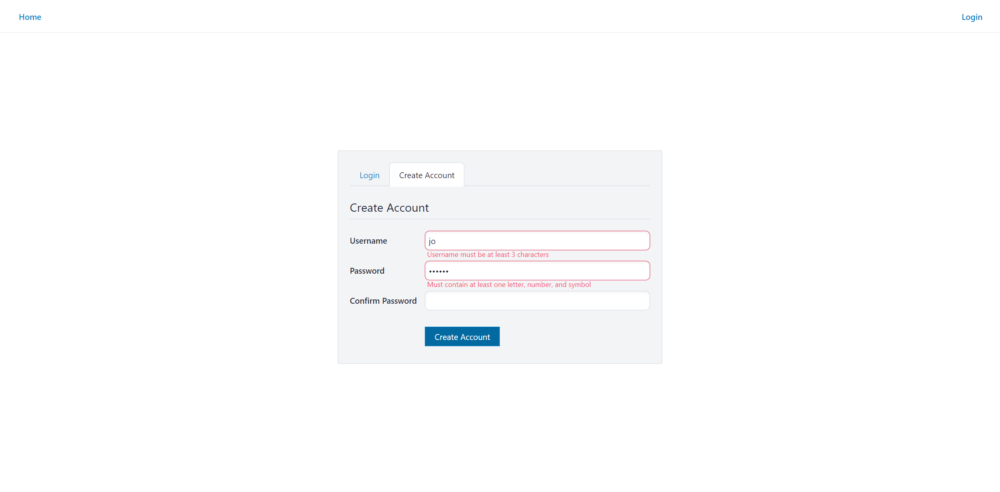
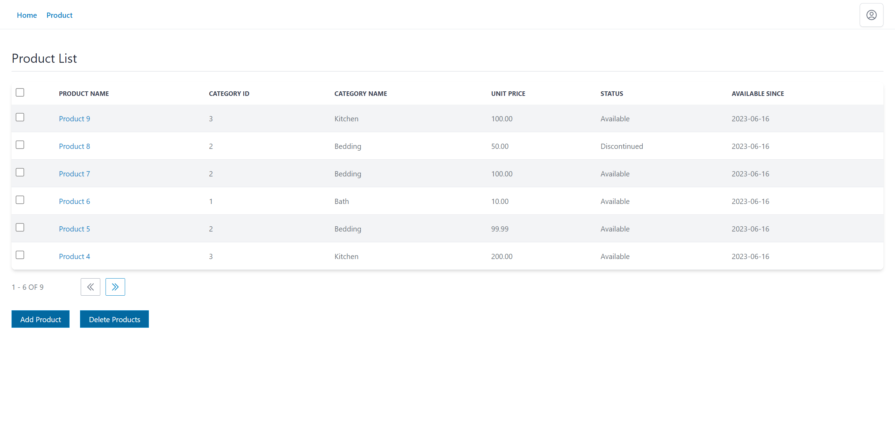
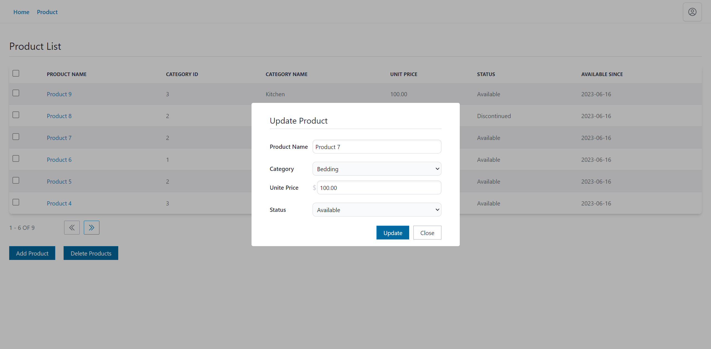
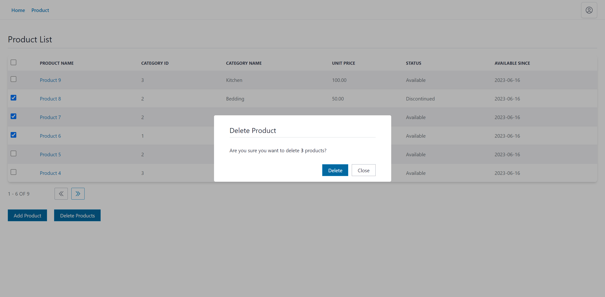

# Auth and Products - UI (Next.js + Redux Toolkit + Redux Saga)

**About:** Frontend UI of the "Auth and Products" demo. Built using Next.js, Redux Toolkit, Redux Saga, Tailwind CSS.

**_Check backend API: [https://github.com/remankader/auth-and-products-api](https://github.com/remankader/auth-and-products-api)_**

**Features:**

- Registration
- Login
- Logout
- Add Product
- Update Product
- Delete Product
- Product List Table

## Screenshots

| | | |
|:-:|:-:|:-:|
|  |  |  |
| Login | Registration | Product List Table |

| | | |
|:-:|:-:|:-:|
|  |  |  |
| Add Product | Update Product | Delete Product |

## Start Development Server

- **Step 1:** On root directory make a copy of **.env.local.example** and rename it to **.env.local**

- **Step 2:** Update values in **.env.local**

- **Step 3:** Install dependency packages by running:

```bash
npm install
# or
yarn install
```

- **Step 4:** Start development server by running:

```bash
npm run dev
# or
yarn dev
```

- **Step 5:** Open [http://localhost:3000](http://localhost:3000) with your browser.

**_[ Built on Node v18.15.0 ]_**
